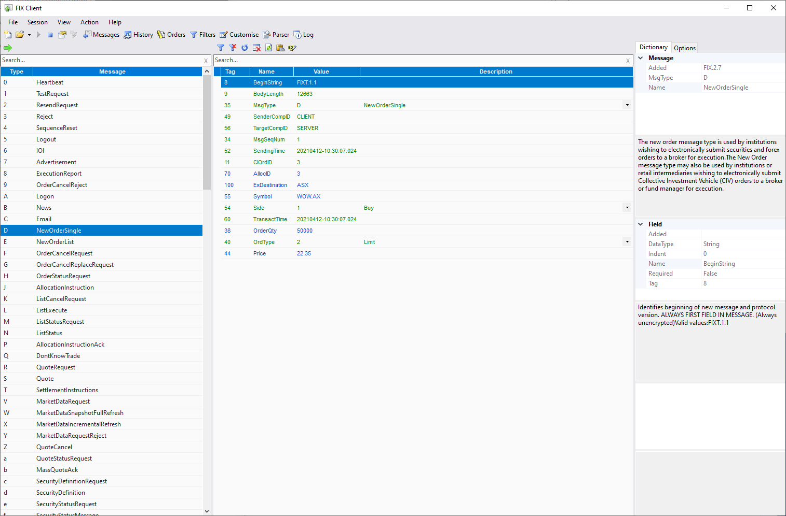

# FIX Client

## Synopsis

FIX Client is a Windows desktop program designed for manually testing [FIX protocol](https://www.fixtrading.org/online-specification/) end points. It can simulate both initiator and acceptor behaviour. FIX Client is written in C# using Winforms and is built on a C# FIX library that can be used standalone to build other programs.

## Releases

If this is the first time you've run FIX Client follow the installation instructions below.

### Latest
This branch is the home of all future development. The initial main difference between this and the legacy 4.x branch is that the data dictionary is now built on the FIX Orchestra standard.
* Download the latest release [5.0.0-pre-release-20](https://github.com/GaryHughes/FixClient/releases/tag/v5.0.0-pre-release-20)

* The libraries FIX Client is built upon are available via nuget [here](https://www.nuget.org/packages?q=Geh.Fix).
    * Documentation for Fix.Dictionary can be found [here](Fix.Dictionary/README.md).
    * Sample code can be found in the [Examples.](https://github.com/GaryHughes/FixClient/tree/master/Examples)

### Legacy
This branch maintains historic functionality and is built on a FIX Repository based data dictionary.
* Download the latest stable release [4.0.0](https://github.com/GaryHughes/FixClient/releases/tag/v4.0.0)

## Installation

* Install the [.NET 5.0 Desktop Runtime](https://dotnet.microsoft.com/download/dotnet/thank-you/runtime-desktop-5.0.5-windows-x64-installer)
    * **NB** FIX Client is not compatible with **.NET 5.0.4** Please see [here](https://github.com/GaryHughes/FixClient/issues/2) for details.  
* FIX Client is distributed as .NET single file application, just download FixClient.exe from a [release](https://github.com/GaryHughes/FixClient/releases) and run it.

## Building

### Command Line
* Install the [.NET 5.0 SDK](https://dotnet.microsoft.com/download/dotnet/thank-you/sdk-5.0.202-windows-x64-installer)
* Clone this repository and change into the repository root directory.
* On the command line type `dotnet publish -c Release -r win-x64`
* The resulting executable can be retrieved from `FixClient/bin/Release/net5.0-windows/win-x64/publish/FixClient.exe` 

### Visual Studio
* Install [Visual Studio Community Edition 2019](https://visualstudio.microsoft.com/vs/community/)
* Open `Fix.sln` in the repository root directory.
* Select `Build` -> `Publish FIX Client` from the menu.
* Client the `Publish` button.
* The resulting executable can be retrieved from `FixClient/bin/Release/net5.0-windows/win-x64/publish/FixClient.exe` 

## Acknowledgements

This repository includes parts of the www.fixtrading.org XML Repository Copyright (c) FIX Protocol Ltd. All Rights Reserved.
